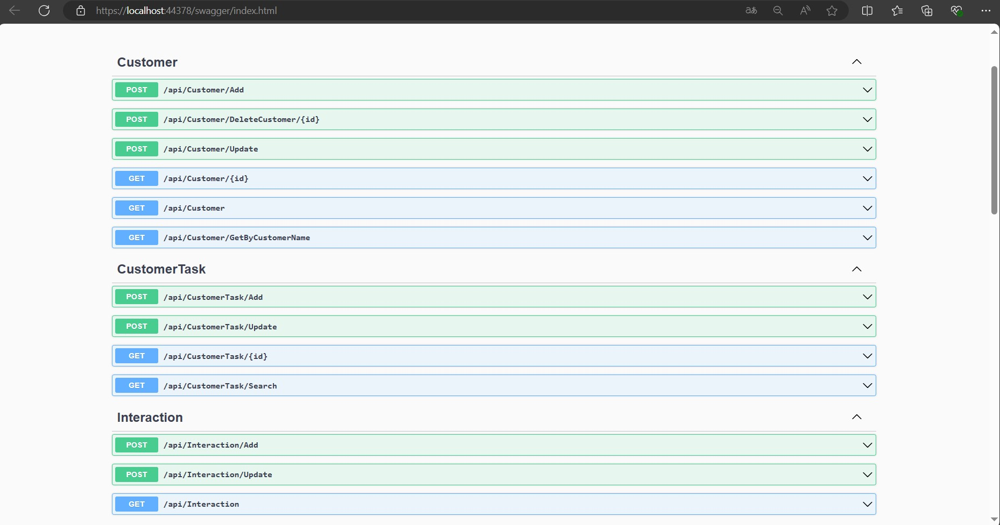
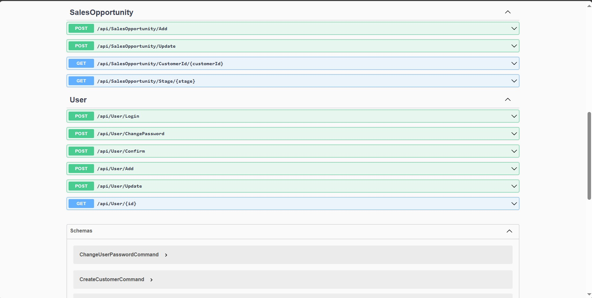

# Used Technologies

- Onion Architecture
- Data Seeding (Bogus)
- Generic Repository
- User Login (JWT Token)
- RabbitMQ (Create-Update User)
- MediatR Pattern
 
# Backend





###Customer
- Post /api/Customer/Add : Adds a new customer.
- Post /api/Customer/DeleteCustomer/{id} : Deletes a customer by their ID.
- Post /api/Customer/Update : Updates customer details.
- Get /api/Customer/{id} : Retrieves a customer by their ID.
- Get /api/Customer/Customer : Retrieves all customers.
- Get /api/Customer/GetByCustomerName : Retrieves customers by their name.
###CustomerTask
- Post /api/CustomerTask/Add : Adds a new customer task.
- Post /api/CustomerTask/Update : Updates a customer task.
- Get /api/CustomerTask/{id} : Retrieves a customer task by its ID.
- Get /api/CustomerTask/Search : Searches for customer tasks.
###Interaction
- Post /api/Interaction/Add : Adds a new interaction.
- Post /api/Interaction/Update : Updates an interaction.
- Get /api/Interaction : Retrieves all interactions.
###SalesOpportunity
- Post /api/SalesOpportunity/Add : Adds a new sales opportunity.
- Post  /api/SalesOpportunity/Update : Updates a sales opportunity.
- Get  /api/SalesOpportunity/CustomerId/{customerId} : Retrieves sales opportunities by customer ID.
- Get  /api/SalesOpportunity/Stage/{stage} : Retrieves sales opportunities by stage.
###User
- Post /api/User/Login : Logs in a user.
- Post /api/User/ChangePassword : Changes a user's password.
- Post /api/User/Confirm : Confirms a user's account.
- Post /api/User/Add : Adds a new user.
- Post /api/User/Update : Updates user details.
- Get /api/User/{id} :  Retrieves a user by their ID.
  
# Usage

## Prerequisites

Before you begin, ensure you have met the following requirements:
- .NET Core SDK installed 
- PostgreSQL installed and running
- An IDE or text editor such as Visual Studio or Visual Studio Code

## Setup
1. **Clone the repository**

    ```bash
    git clone https://github.com/berfin-t/CRM.git
    cd CRM
    ```
2. **Configure PostgreSQL**

    Create a PostgreSQL database and update the connection string in `appsettings.json` or your environment variables.

    ```json
    "ConnectionStrings": {
        "DefaultConnection": "Host=localhost;Database=yourdatabase;Username=yourusername;Password=yourpassword"
    }
    ```
3. **Apply Migrations**

    Apply the EF Core migrations to your PostgreSQL database to set up the schema.

    ```bash
    dotnet ef database update
    ```
## Running the Application

1. **Restore the dependencies**

    ```bash
    dotnet restore
    ```
2. **Build the project**

    ```bash
    dotnet build
    ```
3. **Run the application**

    ```bash
    dotnet run
    ```
